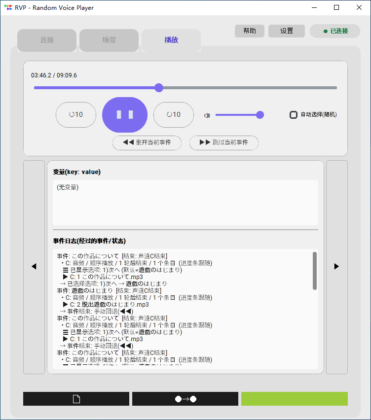
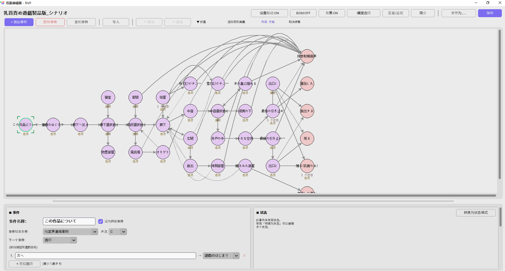
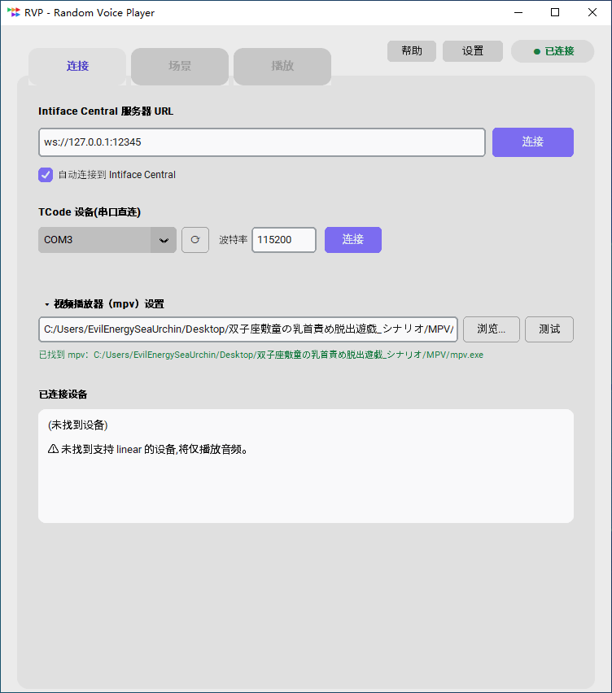

# RVP — Random Voice Player

按场景脚本播放音频的可编程语音播放器。

<!-- 图片占位符:主界面(播放画面)截图 -->



可用 JSON 定义融合分支、选项、变量、随机与 BGM 的场景,
场景可通过附带的 GUI 编辑器创建。
还支持与外部设备(Intiface / TCode)及视频(mpv)的同步播放。

<!-- 图片占位符:场景编辑器界面截图 -->


## 特性

- **场景驱动播放**: 沿着由事件串联的场景播放音频(wav/mp3)。
  分支、选项、数值输入与变量都会改变剧情走向。
- **3 声道同时播放 + BGM**: L/C/R 三个声道可同时播放不同的音频。
  BGM 声道可以跨事件持续播放音乐。
- **随机与权重**: 播放顺序、分支去向、等待时间等可按权重随机决定。
  支持无重复抽签(抽袋法),也支持排除已访问过的事件。
- **游戏化场景**: 通过变量与分支的组合,
  可以制作大富翁、问答、战斗(HP 制)之类的场景。
- **GUI 场景编辑器**: 一边查看事件转移图一边拖放
  配置音频。支持变量监视,以及播放过程中的实时调试。
- **视频播放(可选)**: 与 [mpv](https://mpv.io/) 联动播放视频素材。
- **设备联动(可选)**: 可通过 [Intiface Central](https://intiface.com/central/) 的
  蓝牙设备,以及 TCode 兼容设备(串口连接),
  用 funscript / CSV 脚本与音频同步驱动。
  内置脚本编辑与图案配置功能。
- **背景插画**: 可将语音作品附带的插画等显示为
  整个播放画面的背景。可按事件/状态切换,切换带淡入淡出
  (亮度可调。显示开关可由收听方自行切换)。
- 支持 **日语 / English / 简体中文** 界面切换。

## 运行环境

- Windows 11(64 位)
- (可选) 视频播放:mpv
- (可选) 设备联动:Intiface Central 或 TCode 兼容设备

## 安装

### 方式 1:exe 版(推荐)

1. 从 [Releases](../../releases) 下载最新的 `RVP-vx.x.x-win64.zip`。
2. 解压 zip,运行 `RVP` 文件夹内的 **`RVP.exe`**
   (整个文件夹为一套,请勿单独移动 exe)。

> **注意**:PyInstaller 制作的 exe 有可能被杀毒软件误报
> (已知的普遍现象)。如被拦截,请将 zip 的解压目录
> 加入排除列表,或使用方式 2 从源码运行。

### 方式 2:用 Python 运行

只要安装了 Python 3.12 以上版本,即可从源码运行。

```bat
py -m pip install -r requirements.txt
py rvp_launcher.py
```

`requirements.txt` 中的 tkinterdnd2(拖放)与
pyserial(TCode 直连)为可选依赖。即使未安装,除相关功能外均可正常使用。

## 播放场景

1. 启动 RVP,在「场景」标签页选择场景文件(`.json`)。
   分发的场景请连同音频文件一起以文件夹形式放置。
2. 切换到「播放」标签页后按 ▶ 开始播放。出现选项时点击按钮选择。

使用设备时,请先在「连接」标签页完成 Intiface Central 的连接
(或选择 TCode 的端口),然后再开始播放。

<!-- 图片占位符:连接标签页截图 -->


## 创建场景

1. 在「场景」标签页点击「新建场景」(或现有场景的「编辑」),
   打开场景编辑界面。
2. 选择事件,向声道(L/C/R)点击「+音频」
   或通过拖放放置音频文件。
3. 用「下一个事件:」把事件连接起来,保存后到「播放」标签页试玩。

场景文件(JSON)的完整参考请见
[SCENARIO_FORMAT.md](SCENARIO_FORMAT.md)。

## 使用视频(可选)

播放视频素材需要 mpv(免费)。安装 mpv 并在
「连接」标签页设置 mpv 路径后,场景中的视频素材
即可播放。即使没有 mpv,除视频外的所有功能均可使用。

## 示例场景

带音频的演示场景计划在 Ci-en 上分发。
<!-- TODO: 公开时补充 Ci-en 的 URL -->

## 注意事项

- 使用设备时,请遵循设备说明书,
  在合理的设置范围(活动范围·强度)内使用。
- 分发场景文件时,
  请确认文件中不包含绝对路径。
  (若使用绝对路径,会泄露电脑的用户名。)

## 联系方式

[X(Twitter)](https://x.com/TorpCsv) 或 Ci-en。

## 许可证

- RVP 本体:[MIT License](LICENSE) © 2026 Torp
- 附带及依赖的 OSS 许可证请参阅
  [THIRD-PARTY-LICENSES.txt](THIRD-PARTY-LICENSES.txt)。
